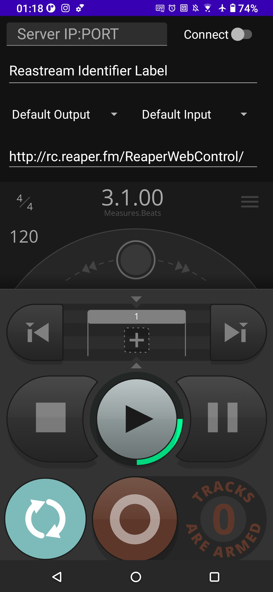
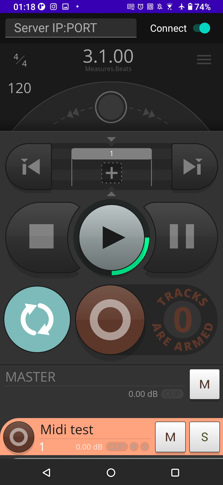

# ReaStreamMobile

Android app that is able to communicate with Reaper's Reastream plugin

App GUI interface:
Initial State              |  Connected State
:-------------------------:|:-------------------------:
 | 
